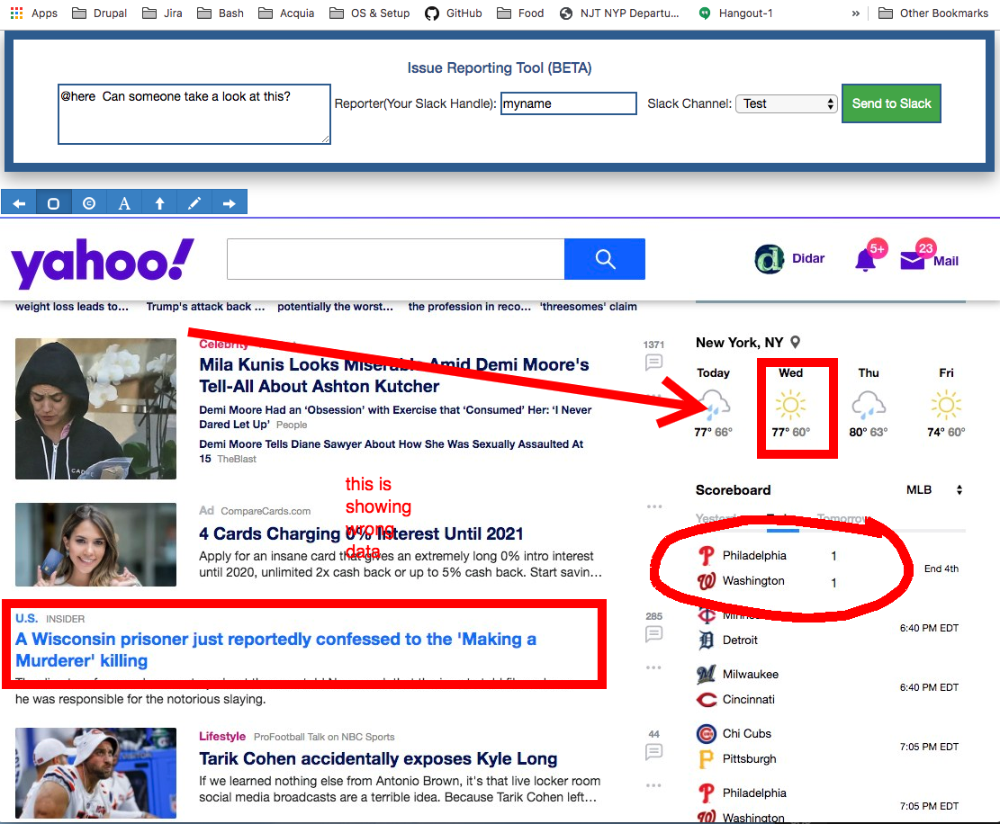

# [ Sky Tool | Chrome Extension ]

### Features
* Navigate to different URLs based on current URL.
* Right click context menu integration.
* Take screenshot and annotate of the page then send to slack.
* Track console log errors.
* OMNIBOX integration to navigate different URLs by specific keywords.

### Installation
* Clone this repo.
* Using Chromes extension page, load this extension.
* Host server-files somewhere in the cloud for slack to grab image URL.